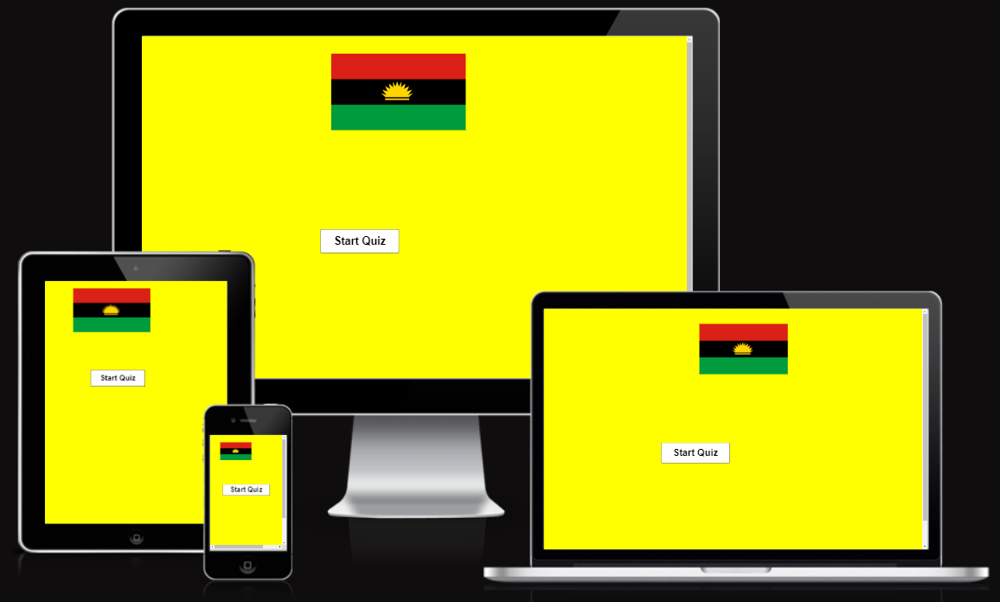
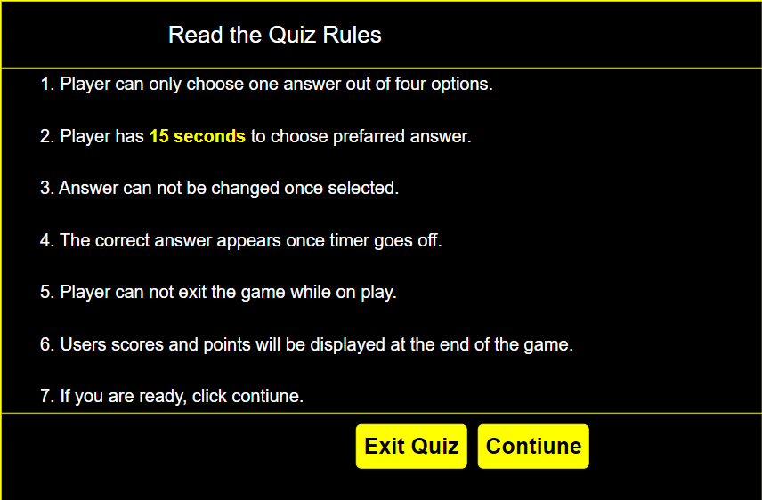
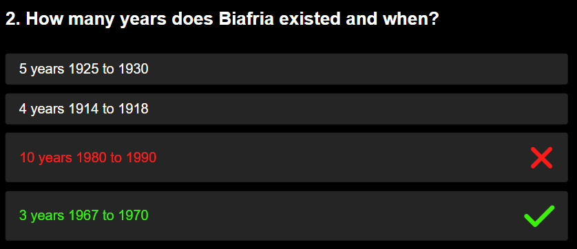
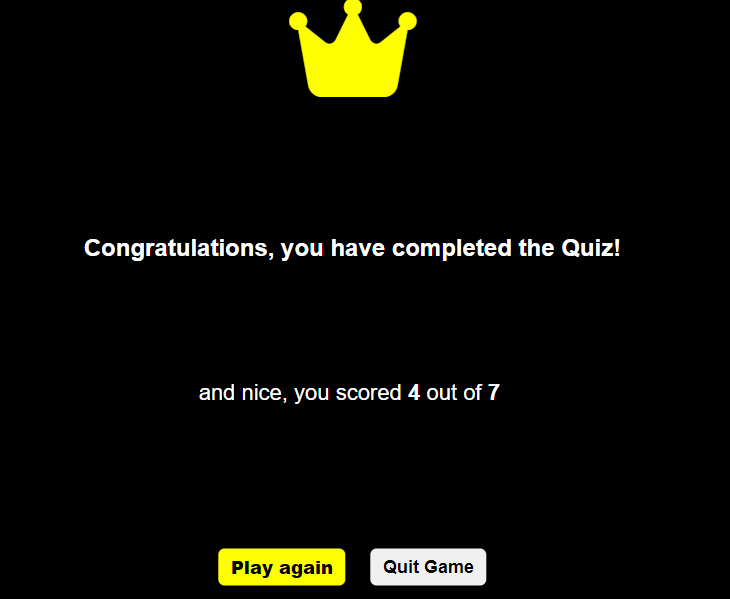
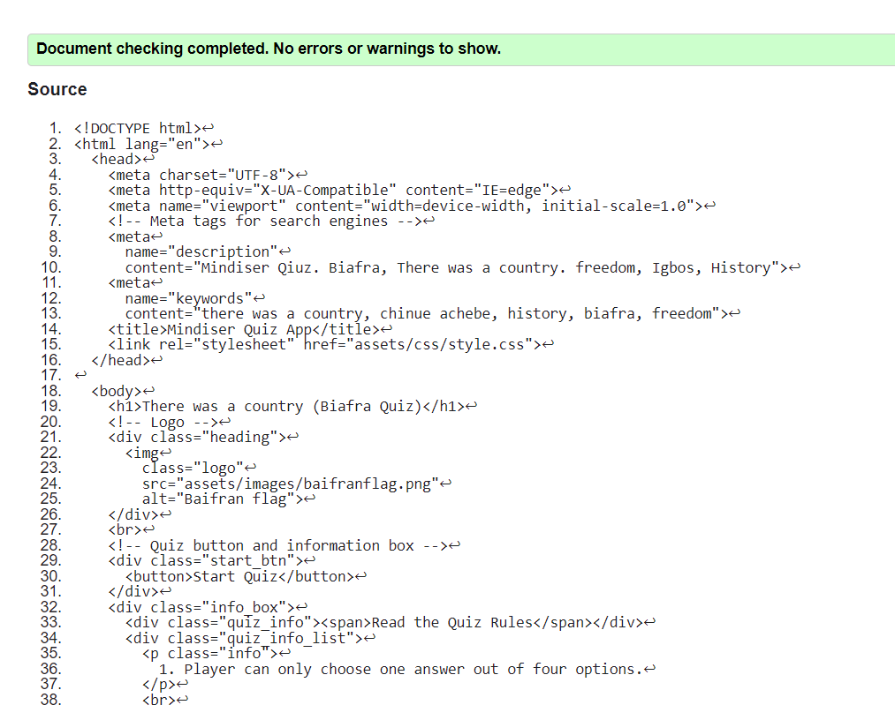
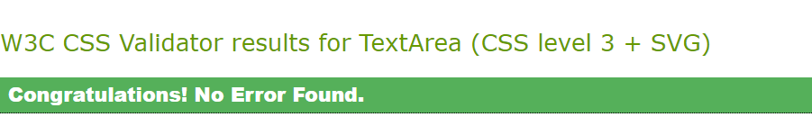
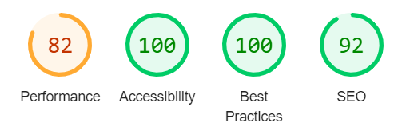

The live link can be found here - <https://madu-j.github.io/mindiser/>

# Mindiser Quiz App

Mindiser Quiz app is a Biafra quiz inspired by the novel "There was a country". A novel written by Chinua Achebe. “There Was a Country…” actually means what it says. It is neither a prefatory statement nor folkloric rhetoric. There was indeed a country that embodied the aspirations of a people, who in unison, did all they could to preserve it, but lost it due to factors beyond their control.

In addition Mindiser is a quiz app that wants to put in the mind of users the present state of Biafra as Biafrans contiunes in their quest for freedom.

The app demonstrate how pure JavaScript works in a real-world context. The site will be targeted toward people who not only love to implement more advanced JavaScript concepts but also to people who love history. The site is a fully responsive JavaScript game that will allow users to read a question and give them option to choose their answer.

## Features

### Existing Features

- __Mindiser quiz app Heading__

  - Featured at the top of the page, Mindiser quiz app heading is easy to see for the users. Upon viewing the page, the user will be able to see the name of the game a start button that will take users to the game rules. 

- __The Game Area__

  - The quiz game app have a clear information that tells the user how what to expect.
 -  The user will have four answer options to choose from
  - The user will be able to choose any answer he or she thinks or knows is correct.
- Once the user chooses an answer, its irreversible.
- If the user answer is wrong, the app will mark what the user choosed as well as mark the correct answer.
- The user will have limited time to answer each question. once the user choose his or or her answer the timer stops. If the user couldn't choose answer before the give time frame, the app will choose the correct answer at authomatically.
- At the end of the game the user will see his or her score and can choose wheather to replay the game or quiz.

- __The Score Area__

  - The uses will only see result at the end of the game. However the user will see how many questions are wleft.

### Features Left to Implement

## Testing

### Validator Testing

- HTML
  - No errors were returned when passing through the official [W3C validator](https://validator.w3.org/) 
- CSS
  - No errors were found when passing through the official [(Jigsaw) validator](https://jigsaw.w3.org/css-validator/) 
- Lighthouse
-  No errors were found however, there was warning when passing through the official [Jshint validator](https://jigsaw.w3.org/css-validator/)
- I used devtools to run it through lighthouse to test the accessibility, Perfomance and SEO 
- JavaScript

## Deployment

- The site was deployed to GitHub pages. The steps to deploy are as follows:
  - In the GitHub repository, navigate to the Settings tab
  - From the source section drop-down menu, select the Master Branch
  - Once the master branch has been selected, the page will be automatically refreshed with a detailed ribbon display to indicate the successful deployment.

The live link can be found here - <https://madu-j.github.io/mindiser/>

## Credits
